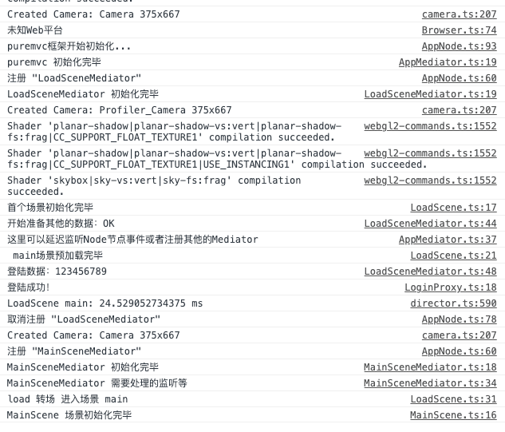
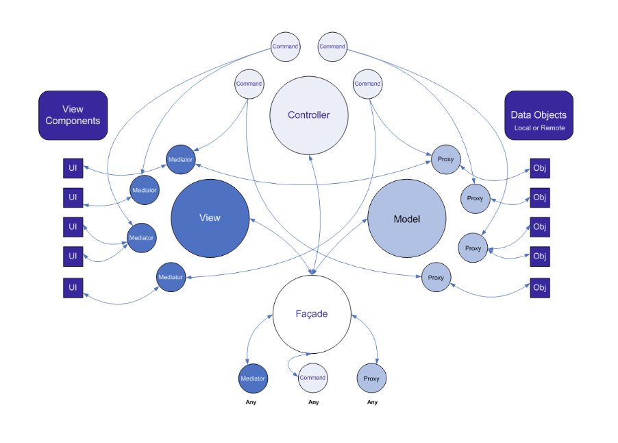
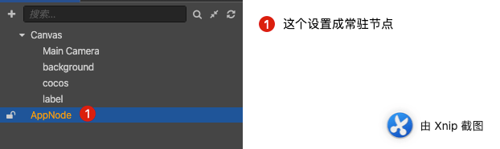
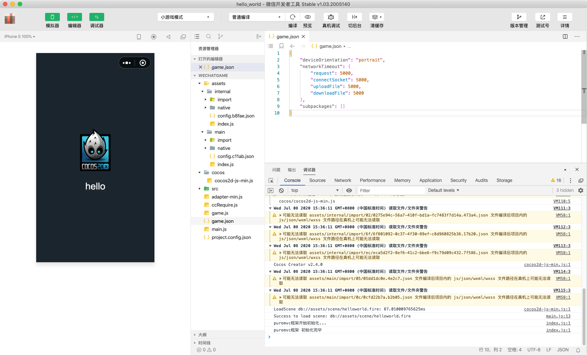
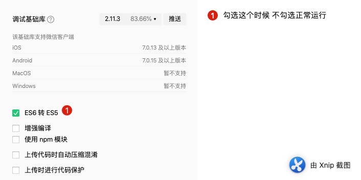

# PureMVC 如何在Cocos Creator里面使用
## 注意

- **master 分支为 Cocos Creator 3.7.2 （3.7.2）版本**   **2023年4月21更新**

- **3.0.1分支为 Cocos Creator 3.0 （3.0.1）版本**

- **2.4.0 分支为 Cocos Creator 2.4（2.4.0）版本**

- **3.7.2plus 分支为 Cocos Creator 3.7.2 泛型使用分支（3.7.2）版本**   **2023年4月23更新**

- 分支 2.4.11 为原来的 Cocos Creator 2.4.11 版本

  注:此分支采用ES6 类的方式开发 不再使用 插件方式 更新时间 **2023年 4月21日**

笔者是从十年前页游时代开始进入游戏行业的，那时候比较流行的框架是MVC框架，这些年陆续出现了很多类似的框架，总的来讲万变不离其宗，都是做到了数据和UI分离，模块化，高内聚，低耦合，模块间正交性越高，越容易解耦。以前做Flash游戏的时候，用了一个叫PureMVC的框架，很好用，那时候刚刚入门，主要了解如何使用，如何发送消息，随着在编程行业沉浸多年后，慢慢的对游戏框架和引擎设计有了新的认识。

关于PureMVC框架的介绍，这里不在赘述，关于 Cocos Creator 这样的ECS系统的引擎开发需要不需要框架，仁者见仁，智者见智，论坛里大家都曾热烈讨论，因我个人经历，我说比较偏向于使用框架的那类人，框架，其实就是团队代码规范手册，或者约束手册，通过框架的学习可以大家风格尽可能的一致，便于彼此熟悉代码（团队就自己一个人的可以忽略）另外大多数的框架都做到了模块的低耦合，信息或者事件传递的一对多的机制，便于信息发布和订阅（订阅模式）

对框架的看法文章后会再说，现在先看看如何配置吧。 

## 核心思想

### 类库从插件修改为ts文件

1. [Cocos Creator 3.0](https://www.cocos.com/docs) 开始 官方不在推荐使用插件模式，这次我们为了更好的向后兼容，这里我们采用纯`Typescript`的`PureMVC`的版本（官网也提供了对应版本）
2. 这里对版本略微改造，把多个`Typescript`文件放到了一个叫做`puremvc.ts`的文件里，对于类库或者框架来说，后期我们很少改动，稳定性比较高，所以放到一个叫做lib的文件夹里，这样避免多个文件分散开发者的心思。
3. 官方的源码除去注释大概只有不到800行 核心代码大概500行左右，算得上是一个极简的框架，如果稍有点耐心的人，读读源码便理解了框架到底解决了什么问题。
4. 引入框架的目的肯定是要解决一些问题或者通过框架的约束避免一些问题的，这一点，希望用框架的人一定要谨记，框架是官方给的一种思想的具体表现，如果自己觉得某个地方不太好，可以修改为更适合自己项目的方式，前提是自己必须了解修改后有没有引入问题和解决问题。

### 启动文件挂在常驻节点

常驻节点可以成为场景之间切换后存在的全局变量，一些常用的UI容器，或者不想伴随场景销毁而被回收的脚本或者变量可以借助常驻节点的设计挂在这个节点上。

### Cocos Creator组件周期和框架灵活结合

首先我们知道 Typescript是单继承 如果想让脚本挂在在节点上就必须继承 `Component` 这样 如果想结合`puremvc` 大概有下面几种情况

1. 脚本继承`Component`类 实现 `IMediator`，`INotifier`接口
2. 脚本继承`Mediator`类实现`Component`类的对应接口
3. 脚本继承`Mediator`类修改`Mediator`类 让 `Mediator`类 和 `Notifier`类 中间 插入一个套件 类 
4. 脚本继承`Mediator`类修改`Mediator`类 `Notifier` 类 继承`Component`类
5. 两个脚本，其中一个继承`Component`类 另外一个继承 `Mediator`类 然后进行动态或者挂载 同一个节点绑定
6. 其他模式

上面列举了几种实现结合的方法，各有优劣，弊端，这里我选择了第5个方案，其他方案大家可以自行尝试，比较他们各自的优劣。

项目研发中，一般来说方法使命唯一，或者说职责唯一，本来PureMVC 的view可以主动控制UI层的，但是[Cocos Creator](https://www.cocos.com/docs)是节点树的渲染方式控制节点和节点上组件的生命周期（`onLoad`，`onEnable`，`start`，update，`lateUpdate`，`onDisable`，`onDestroy`），基于引擎已经提供的这些，结合`Mediator` 和`Node`进行绑定，让一个功能的模块（这里模块是指功能相对独立，需要和外部其他Node或者预置体通信）

## 实现

### 3.7.2效果如下：


日志输出如下


### 效果如下


日志输出如下：




### 新建场景

1. 新建两个场景 一个叫做load（游戏的首个加载场景）另外一个叫做main（游戏主场景）一般来说如果游戏比较复杂一点都会首先让用户看到一个加载场景，然后加载用户进入游戏中需要的基本素材，这样可以缓解游戏黑屏的时间，让用户看到加载进度等，更有耐心等等待游戏加载和数据准备，避免用户过早的流失。
2. 项目结构如下

```bash
/Cocos-Creator-PureMVC-Demo/assets
├── .DS_Store
├── lib
|  ├── puremvc.ts
|  └── puremvc.ts.meta
├── lib.meta
├── load.scene
├── load.scene.meta
├── main.scene
├── main.scene.meta
├── res
|  ├── HelloWorld.png
|  ├── HelloWorld.png.meta
|  ├── img_bg.png
|  ├── img_bg.png.meta
|  ├── img_c_bg.png
|  ├── img_c_bg.png.meta
|  ├── img_glass.png
|  ├── img_glass.png.meta
|  ├── img_m_bg.png
|  ├── img_m_bg.png.meta
|  ├── singleColor.png
|  └── singleColor.png.meta
├── res.meta
├── src
|  ├── AppMediator.ts
|  ├── AppMediator.ts.meta
|  ├── AppNode.ts
|  ├── AppNode.ts.meta
|  ├── Browser.ts
|  ├── Browser.ts.meta
|  ├── base
|  |  ├── BaseMediator.ts
|  |  ├── BaseMediator.ts.meta
|  |  ├── BaseScene.ts
|  |  ├── BaseScene.ts.meta
|  |  ├── BaseUI.ts
|  |  ├── BaseUI.ts.meta
|  |  ├── BaseView.ts
|  |  └── BaseView.ts.meta
|  ├── base.meta
|  ├── com
|  |  ├── BaseProxy.ts
|  |  ├── BaseProxy.ts.meta
|  |  ├── LoadScene.ts
|  |  ├── LoadScene.ts.meta
|  |  ├── LoadSceneMediator.ts
|  |  ├── LoadSceneMediator.ts.meta
|  |  ├── LoginCmd.ts
|  |  ├── LoginCmd.ts.meta
|  |  ├── LoginProxy.ts
|  |  ├── LoginProxy.ts.meta
|  |  ├── MainScene.ts
|  |  ├── MainScene.ts.meta
|  |  ├── MainSceneMediator.ts
|  |  └── MainSceneMediator.ts.meta
|  ├── com.meta
|  ├── config
|  |  ├── MsgConst.ts
|  |  └── MsgConst.ts.meta
|  ├── config.meta
|  ├── core
|  |  ├── AppFacade.ts
|  |  ├── AppFacade.ts.meta
|  |  ├── ControllerCmd.ts
|  |  ├── ControllerCmd.ts.meta
|  |  ├── ModelPrepCmd.ts
|  |  ├── ModelPrepCmd.ts.meta
|  |  ├── StartupCmd.ts
|  |  ├── StartupCmd.ts.meta
|  |  ├── ViewPrepCmd.ts
|  |  └── ViewPrepCmd.ts.meta
|  ├── core.meta
|  ├── data
|  |  ├── Inters.ts
|  |  └── Inters.ts.meta
|  └── data.meta
└── src.meta

directory: 8 file: 69
```

###  2.4.11分支  Cocos Creator 2.4.11 版本

注:此分支采用ES6 类的方式开发 不再使用 插件方式 更新时间 2023年 4月21日

详细使用可以参考分支源码。

## 2.4.0分支 说明




这次主要聊聊在Cocos Creator 这样的ECS(实体组件)系统里如何和PureMVC结合使用，之前我也写过如何在Layabox里面用PureMVC框架。一年后的今天，再次谈谈如何在Cocos Creator中用这个框架

### 介绍

关于puremvc的介绍，网上一搜一大堆，说白了就是它是一个多语言实现的一个mvc轻量级架构

目前支持的语言：[ACTIONSCRIPT](https://github.com/PureMVC/puremvc-as3-multicore-framework/wiki) [C++](https://github.com/PureMVC/puremvc-cpp-multicore-framework/wiki) [C#](https://github.com/PureMVC/puremvc-csharp-multicore-framework/wiki) [COLDFUSION](https://github.com/PureMVC/puremvc-cf-standard-framework/wiki) [DART](https://github.com/PureMVC/puremvc-dart-multicore-framework/wiki) [DELPHI](https://github.com/PureMVC/puremvc-delphi-standard-framework/wiki) [GO](https://github.com/PureMVC/puremvc-go-multicore-framework/wiki) [HAXE](https://github.com/PureMVC/puremvc-haxe-multicore-framework/wiki) [JAVA](https://github.com/PureMVC/puremvc-java-multicore-framework/wiki) [JAVASCRIPT](https://github.com/PureMVC/puremvc-js-multicore-framework/wiki) [KOTLIN](https://github.com/PureMVC/puremvc-kotlin-multicore-framework/wiki) [OBJECTIVE C](https://github.com/PureMVC/puremvc-objectivec-standard-framework/wiki) [PERL](https://github.com/PureMVC/puremvc-perl-multicore-framework/wiki) [PHP](https://github.com/PureMVC/puremvc-php-multicore-framework/wiki) [PYTHON](https://github.com/PureMVC/puremvc-python-multicore-framework/wiki) [RUBY](https://github.com/PureMVC/puremvc-ruby-standard-framework/wiki) [SWIFT](https://github.com/PureMVC/puremvc-swift-multicore-framework/wiki) [TYPESCRIPT](https://github.com/PureMVC/puremvc-typescript-multicore-framework/wiki)

由此看出，市场上流行的语言基本都是支持的，当然官网没有实现的有的也可以在网上搜到其他非官方的版本。

自己是从AS3开始用的，后面经历的JavaScript 到Typescript，于是又开始使用这个框架。

### 仓库地址

https://github.com/PureMVC

Typescript 标准版地址：https://github.com/PureMVC/puremvc-typescript-standard-framework

TYpescript 多核版地址:  https://github.com/PureMVC/puremvc-typescript-multicore-framework

我一般选择使用 标准版即可，下面看看标准版项目仓库的目录


开发团队做的比较好，给出了测试例子，编译工具 **ant+yuicompressor** 源码目录

简单的介绍一下这个目录：

- bin： 编译后的.d.ts文件 .js文件.min.js文件
- build: yuiant 和yuicompressor 压缩合并工具（项目构建使用）
- test: 官方给了一个web 版本的 测试demo
- 其他说明信息配置

#### 环境

- Mac 系统
- Cocos Creator 2.4.0
- PureMVC Typescript 标准版

先说说如何使用吧。

### 配置步骤

1. 新建一个项目：Cocos-Creator-PureMVC-Demo


2. 首先下载仓库到本地，然后把bin 目录的 .d.ts文件 .js文件（当然用min.js也可以） 复制到Cocos的assets 目录，这里我新建了一个叫lib的文件夹，专门存放第三方类库。


3. 然后在Cocos Creator编辑器里面选择插件方式


4. 此时回到代码编辑器里面，这个导出的源代码需要重新指定一下全局变量 puremvc，具体操作如下

   - 注释掉前面几行（四行，具体看图）

     

   - 注释掉后面几行（三行，具体看图）并添加 代码：`window.puremvc = puremvc;`

     

此时puremvc 的类配置工作已经做好，剩下的就是初始化工作：

### 编写步骤

1. 编写我们额第一个初始化类：App.ts（文件挂在游戏内的常驻节点上面）




2. 代码具体内容如下

App.ts

```typescript
/**
 * Created by jsroads on 2020/6/11.5:58 下午
 * Note:
 */
/**
 *
 *
 *                                                    __----~~~~~~~~~~~------___
 *                                   .  .   ~~//====......          __--~ ~~
 *                   -.            \_|//     |||\\  ~~~~~~::::... /~
 *                ___-==_       _-~o~  \/    |||  \\            _/~~-
 *        __---~~~.==~||\=_    -_--~/_-~|-   |\\   \\        _/~
 *    _-~~     .=~    |  \\-_    '-~7  /-   /  ||    \      /
 *  .~       .~       |   \\ -_    /  /-   /   ||      \   /
 * /  ____  /         |     \\ ~-_/  /|- _/   .||       \ /
 * |~~    ~~|--~~~~--_ \     ~==-/   | \~--===~~        .\
 *          '         ~-|      /|    |-~\~~       __--~~
 *                      |-~~-_/ |    |   ~\_   _-~            /\
 *                           /  \     \__   \/~                \__
 *                       _--~ _/ | .-~~____--~-/                  ~~==.
 *                      ((->/~   '.|||' -_|    ~~-/ ,              . _||
 *                                 -_     ~\      ~~---l__i__i__i--~~_/
 *                                 _-~-__   ~)  \--______________--~~
 *                               //.-~~~-~_--~- |-------~~~~~~~~
 *                                      //.-~~~--\
 *                               神兽保佑
 *                              代码无BUG!
 */
import IMediator = puremvc.IMediator;
import IProxy = puremvc.IProxy;
import Browser from "./channel/Browser";
import {AppFacade} from "./core/AppFacade";

const {ccclass,disallowMultiple, menu,executionOrder} = cc._decorator;
@ccclass
@disallowMultiple()
@menu('常住节点组件/App')
@executionOrder(-10000)
export default class App extends cc.Component {
    protected onLoad() {
        /** 添加当前节点为常住节点*/
        cc.game.addPersistRootNode(this.node);
    }
    start() {
        console.log("puremvc框架开始初始化...");
        App.instance.startup();
        // cc.debug.setDisplayStats(false);
        // cc.game.removePersistRootNode(this.node);
        if (Browser.onAndroid) {
            console.log("Android添加监听返回键")
            cc.systemEvent.on(cc.SystemEvent.EventType.KEY_DOWN, this.onKeyDown, this);
        }
    }
    private onKeyDown(event):void {
        switch (event.keyCode) {
            case cc.macro.KEY.back:
                cc.game.end();
                break;
            default:
        }
    }

    public static registerProxy( proxy:IProxy ):void{
        this.instance.registerProxy(proxy);
    }

    public static retrieveProxy(name: string,data:any): IProxy {
        let proxy =  this.instance.retrieveProxy(name);
        proxy.setData(data);
        return proxy;
    }

    public static removeProxy(name: string): IProxy {
        return this.instance.removeProxy(name);
    }

    public static registerMediator( mediator:IMediator ):void{
        this.instance.registerMediator(mediator);
    }

    public static retrieveMediator(name: string,node:cc.Node): IMediator {
        if(!this.instance.hasMediator(name)){
            console.error(`Mediator ${name} 未注册`);
        }
        let mediator =  this.instance.retrieveMediator(name);
        mediator.setViewComponent(node);
        return mediator;
    }

    public static removeMediator(name: string): IMediator {
        return this.instance.removeMediator(name);
    }

    public static sendNotification(name:string, body?:any, type?:string):void{
        this.instance.sendNotification(name,body,type);
    }

    public static get instance():AppFacade{
        return  AppFacade.getInstance();
    }
}
```

AppFacade.ts

```typescript
/**
 * Created by jsroads on 2020/6/11.2:38 下午
 * Note:
 *
 *
 *                  ___====-_  _-====___
 *            _--^^^#####//      \\#####^^^--_
 *         _-^##########// (    ) \\##########^-_
 *        -############//  |\^^/|  \\############-
 *      _/############//   (@::@)   \\############\_
 *     /#############((     \\//     ))#############\
 *    -###############\\    (oo)    //###############-
 *   -#################\\  / VV \  //#################-
 *  -###################\\/      \//###################-
 * _#/|##########/\######(   /\   )######/\##########|\#_
 * |/ |#/\#/\#/\/  \#/\##\  |  |  /##/\#/  \/\#/\#/\#| \|
 * `  |/  V  V  `   V  \#\| |  | |/#/  V   '  V  V  \|  '
 *    `   `  `      `   / | |  | | \   '      '  '   '
 *                     (  | |  | |  )
 *                    __\ | |  | | /__
 *                   (vvv(VVV)(VVV)vvv)
 *                        神兽保佑
 *                       代码无BUG!
 */
import Facade = puremvc.Facade;
import IFacade = puremvc.IFacade;
import {NotificationConst} from "./NotificationConst";
import StartupCommand from "./StartupCommand";

/**
 * ApplicationFacade 类对象负责初始化Controller（控制器），建立Command与Notification 名之间的映射；
 * 并执行一个Command注册所有的 Model 和View。它是PureMVC应用程序的入口。
 * @author jsroads
 */
export class AppFacade extends Facade implements IFacade {
    constructor() {
        super()
    }
    public static getInstance(): AppFacade {
        if (!this.instance) this.instance = new AppFacade();
        return <AppFacade>(this.instance);
    }

    /**
     * 为了ApplicationFacade结构更清晰和简洁。
     * 将注册Command、Proxy、View&Mediator的工作抽离到
     * ControllerCommands.ts、ModelPrepCommand.ts、ViewPrepCommand.ts。
     *
     * 注册应用程序启动Startup命令，应用程序启动时执行 StartupCommand
     * StartupCommand中将执行以下操作：
     * ControllerCommand -- 初始化应用程序事件与Command之间的映射关系；
     * ModelPrepCommand --    Model 初始化，初始化应用程序启动过程中需要用到的Proxy，并注册；
     * ViewPrepCommand  --    View 初始化，唯一创建并注册ApplicationMediator，它包含其他所有View Component并在启动时创建它们
     */
    public initializeFacade(): void {
        super.initializeFacade();
        this.registerCommand(NotificationConst.START_UP, StartupCommand);
    }

    /**
     * 启动PureMVC，在应用程序中调用此方法，并传递应用程序本身的引用
     * @param stage    -    PureMVC应用程序的根视图 root，包含其它所有的View Componet
     */
    public startup(stage?: any): void {
        this.sendNotification(NotificationConst.START_UP, stage);
        this.removeCommand(NotificationConst.START_UP);//PureMVC初始化完成，注销STARUP命令
    }
}
```

StartupCommand.ts

```
/**
 * Created by jsroads on 2020/6/11.2:40 下午
 * Note:
 */
import MacroCommand = puremvc.MacroCommand;
import ControllerCommand from "./ControllerCommand";
import ModelPrepCommand from "./ModelPrepCommand";
import ViewPrepCommand from "./ViewPrepCommand";

export default class StartupCommand extends MacroCommand {
    constructor() {
        super();
    }
    //添加子Command 初始化MacroCommand.
    public initializeMacroCommand(): void {
        /**
         * 命令会按照“先进先出”（FIFO）的顺序被执行.
         * 在用户与数据交互之前，Model必须处于一种一致的已知的状态.
         * 一旦Model 初始化完成，View视图就可以显示数据允许用户操作与之交互.
         * 因此，一般“ 开启”（startup ）过程首先Model初始化，然后View初始化。
         */
        this.addSubCommand(ControllerCommand);
        this.addSubCommand(ModelPrepCommand);
        this.addSubCommand(ViewPrepCommand);
    }
}
```

ControllerCommand.ts

```typescript
/**
 * Created by jsroads on 2020/6/11.2:39 下午
 * Note:注册Command ，建立 Command 与Notification 之间的映射
 */
import SimpleCommand = puremvc.SimpleCommand;
import INotification = puremvc.INotification;
import {NotificationConst} from "./NotificationConst";
import LoginCommand from "../controller/LoginCommand";

export default class ControllerCommand extends SimpleCommand {
    constructor() {
        super();
    }
    public execute(note: INotification): void {
        /**登录游戏*/
        this.facade.registerCommand(NotificationConst.LOGIN, LoginCommand);
    }
}
```

ModelPrepCommand.ts

```typescript
/**
 * Created by jsroads on 2020/6/11.2:39 下午
 * Note: 创建Proxy 对象，并注册
 * Model的初始化通常比较简单：创建并注册在“开启”过程中需要用到的Proxy。
 * 这里Command并没有操作或初始任何的Model数据。Proxy 的职责才是取得，创建，和初始化数据对象。
 */
import SimpleCommand = puremvc.SimpleCommand;
import INotification = puremvc.INotification;
import LoginProxy from "../model/proxy/LoginProxy";

export default class ModelPrepCommand extends SimpleCommand {
    constructor() {
        super();
    }

    //由MacroCommand调用
    public execute(note: INotification): void {
        this.facade.registerProxy(new LoginProxy());
    }
}
```

ViewPrepCommand.ts

```typescript
/**
 * Created by jsroads on 2020/6/11.2:39 下午
 * Note:创建Mediator，并把它注册到View.
 */
import SimpleCommand = puremvc.SimpleCommand;
import AppMediator from "./AppMediator";

export default class ViewPrepCommand extends SimpleCommand {
    public constructor() {
        super();
    }
    public execute(notification: puremvc.INotification): void {
        //游戏主舞台
        this.facade.registerMediator(new AppMediator(notification.getBody()));
    }
}
```

NotificationConst.ts

```typescript
/**
 * Created by jsroads on 2020/6/11.2:39 下午
 * Note: 游戏消息集合
 */
export enum NotificationConst {
    /**游戏框架启动*/
    START_UP = 'start_up',
    /**显示加载场景*/
    SHOW_LOADING = 'show_loading',
    /**显示加载场景成功*/
    LOADING_SUCCESS = 'loading_success',
    /**登录游戏*/
    LOGIN = 'login',
    /**登录游戏成功*/
    LOGIN_SUCCESS = 'login_success',
    /**登录游戏失败*/
    LOGIN_FAIL = 'login_fail',
}

```

Browser.ts

```typescript
/**
 * Created by jsroads on 2020/6/11.7:25 下午
 * Note:
 */
export default class Browser {
    constructor() {
        if (cc.sys.isNative) {
            console.log("本地平台");
            if (cc.sys.isMobile) {
                console.log("本地移动平台");
                if (cc.sys.os == cc.sys.OS_ANDROID) {
                    console.log("本地Android平台");
                    Browser.onAndroid = true;
                    return true;
                } else if (cc.sys.os == cc.sys.OS_IOS) {
                    console.log("本地ios平台");
                    Browser.onIOS = true;
                    return false;
                }
            } else {
                console.log("Web平台");
                return false;
            }
        } else {
            console.log("未知Web平台");
            return false;
        }
    }

    //本地时间和服务器时间间隔
    public static timeInterval: number;


    public static get now(): number {
        return cc.sys.now() + Browser.timeInterval * 1000;
    }

    public static get clientWidth(): number {
        return cc.view.getCanvasSize().width;
    }

    public static get clientHeight(): number {
        return cc.view.getCanvasSize().height;
    }

    public static get width(): number {
        return cc.view.getDesignResolutionSize().width;
    }

    public static get height(): number {
        return Browser.width * (Browser.clientHeight / Browser.clientWidth);
    }

    public static get browserType(): string {
        if (Browser.onAndroid) {
            return "android";//android 平台
        } else if (Browser.onIOS) {
            return "ios";//ios 平台
        } else if (Browser.onMiniGame) {
            return "wx";//小游戏 平台修改这里
        } else {
            return "web";//默认 web 平台
        }
    }


    /** 是否小游戏环境（微信，头条，QQ，百度，Vivo，OPPO ）。*/
    public static get onMiniGame(): boolean {
        return cc.sys.platform === cc.sys.WECHAT_GAME;
        // return cc.sys.browserType === cc.sys.BROWSER_TYPE_WECHAT_GAME;
    }

    /** 是否用户id和密码登录 环境（待定）。*/
    public static onUserKey: boolean = false;
    /** 是否Android 环境。*/
    public static onAndroid:boolean = false;
    /** 是否iOS 环境。*/
    public static onIOS:boolean = false;
}

// if (cc.sys.isNative) {
//     cc.log("本地平台");
//     if (cc.sys.isMobile) {
//         cc.log("本地移动平台");
//         if (cc.sys.os == cc.sys.OS_ANDROID) {
//             cc.log("本地Android平台");
//         } else if (cc.sys.os == cc.sys.OS_IOS) {
//             cc.log("本地ios平台");
//         }
//     } else {
//         cc.log("Web平台");
//     }
// }
```

LoginCommand.ts

```typescript
/**
 * Created by jsroads on 2020/6/17.3:27 下午
 * Note:
 */
import LoginProxy from "../model/proxy/LoginProxy";
import SimpleCommand = puremvc.SimpleCommand;

export default class LoginCommand extends SimpleCommand {
    constructor() {
        super();
    }
    public execute(notification: puremvc.INotification): void {
        let proxy: LoginProxy = <LoginProxy>this.facade.retrieveProxy(LoginProxy.NAME);
        proxy.login(notification.getBody());
    }
}
```

BaseProxy.ts

```typescript
/**
 * Created by jsroads on 2020/6/11.2:51 下午
 * Note:
 */
import Proxy = puremvc.Proxy;
import IProxy = puremvc.IProxy;
import {cccExtensionClass} from "../../../lib/ccc";
import {Handler} from "../../utils/Handler";
@cccExtensionClass
export default abstract class BaseProxy extends Proxy implements IProxy {
    public static NAME: string = "BaseProxy";
    constructor(proxyName?: string, data?: any) {
        super(proxyName, data);
        this.proxyName = cc.js.getClassName(this);
    }
    public send(url: string, headers, params, cb: Handler) {
        /*此处设计Http逻辑省略  直接返回成功*/
        cb.runWith({status:"OK"})
    }
}
```

LoginProxy.ts

```typescript
/**
 * Created by jsroads on 2020/6/11.3:00 下午
 * Note:
 */
import BaseProxy from "./BaseProxy";
import {NotificationConst} from "../../core/NotificationConst";
import {cccExtensionClass} from "../../../lib/ccc";

@cccExtensionClass
export default class LoginProxy extends BaseProxy {
    constructor(proxyName?: string, data?: any) {
        super(null, data);
        LoginProxy.NAME = this.proxyName;
    }
    public login(data) {
        this.sendNotification(NotificationConst.LOGIN_SUCCESS);
    }
}
```

ccc.ts

```typescript
/**
 * Created by jsroads on 2020/6/29. 8:09 下午
 * Note:Cocos Creator 提供了cc.js.getClassName这么一个函数，
 * 但是遗憾的时候，当代码混淆后， ccclass装饰过的类是能通过该方法拿到类名，但是自定义的类就拿不到了，
 * 自定义的类混淆后拿到的往往是"t"。
 * 参考地址 https://blog.csdn.net/RICKShaozhiheng/article/details/87922938
 *
 */
/**
 * 将类名赋给该类
 * @param target
 */
export function cccExtensionClass(target: any) {
    let frameInfo = cc['_RF'].peek();
    let script = frameInfo.script;
    cc.js.setClassName(script, target);
    // console.log("@@@@@@@@@@@@@",cc.js.getClassName(target));
}

//在需要的类前像ccclass一样使用这个装饰器就行了:
//
// @heClass
// export abstract class HashObject {
//     private static s_hashCount: number = 1;
//     private _hashCode: number;
//
//     public constructor() {
//         this._hashCode = HashObject.s_hashCount++;
//     }
//
//     public get hashCode(): number {
//         return this._hashCode;
//     }
// }
```

Handler.ts

```typescript
/**
 * <p><code>Handler</code> 是事件处理器类。</p>
 * <p>推荐使用 Handler.create() 方法从对象池创建，减少对象创建消耗。创建的 Handler 对象不再使用后，可以使用 Handler.recover() 将其回收到对象池，回收后不要再使用此对象，否则会导致不可预料的错误。</p>
 * <p><b>注意：</b>由于鼠标事件也用本对象池，不正确的回收及调用，可能会影响鼠标事件的执行。</p>
 */
export class Handler {

    /**@private handler对象池*/
    protected static _pool: Handler[] = [];
    /**@private */
    private static _gid: number = 1;

    /** 执行域(this)。*/
    caller: Object|null;
    /** 处理方法。*/
    method: Function|null;
    /** 参数。*/
    args: any[]|null;
    /** 表示是否只执行一次。如果为true，回调后执行recover()进行回收，回收后会被再利用，默认为false 。*/
    once = false;

    /**@private */
    protected _id = 0;

    /**
     * 根据指定的属性值，创建一个 <code>Handler</code> 类的实例。
     * @param	caller 执行域。
     * @param	method 处理函数。
     * @param	args 函数参数。
     * @param	once 是否只执行一次。
     */
    constructor(caller: Object|null=null, method: Function|null=null, args: any[]|null = null, once: boolean = false) {
        this.setTo(caller, method, args, once);
    }

    /**
     * 设置此对象的指定属性值。
     * @param	caller 执行域(this)。
     * @param	method 回调方法。
     * @param	args 携带的参数。
     * @param	once 是否只执行一次，如果为true，执行后执行recover()进行回收。
     * @return  返回 handler 本身。
     */
    setTo(caller: any, method: Function|null, args: any[]|null, once=false): Handler {
        this._id = Handler._gid++;
        this.caller = caller;
        this.method = method;
        this.args = args;
        this.once = once;
        return this;
    }

    /**
     * 执行处理器。
     */
    run(): any {
        if (this.method == null) return null;
        let id: number = this._id;
        let result: any = this.method.apply(this.caller, this.args);
        this._id === id && this.once && this.recover();
        return result;
    }

    /**
     * 执行处理器，并携带额外数据。
     * @param	data 附加的回调数据，可以是单数据或者Array(作为多参)。
     */
    runWith(data: any): any {
        if (this.method == null) return null;
        let id: number = this._id,result: any;
        if (data == null)
             result = this.method.apply(this.caller, this.args);
        else if (!this.args && !data.unshift) result = this.method.call(this.caller, data);
        else if (this.args) result = this.method.apply(this.caller, this.args.concat(data));
        else result = this.method.apply(this.caller, data);
        this._id === id && this.once && this.recover();
        return result;
    }

    /**
     * 清理对象引用。
     */
    clear(): Handler {
        this.caller = null;
        this.method = null;
        this.args = null;
        return this;
    }

    /**
     * 清理并回收到 Handler 对象池内。
     */
    recover(): void {
        if (this._id > 0) {
            this._id = 0;
            Handler._pool.push(this.clear());
        }
    }

    /**
     * 从对象池内创建一个Handler，默认会执行一次并立即回收，如果不需要自动回收，设置once参数为false。
     * @param	caller 执行域(this)。
     * @param	method 回调方法。
     * @param	args 携带的参数。
     * @param	once 是否只执行一次，如果为true，回调后执行recover()进行回收，默认为true。
     * @return  返回创建的handler实例。
     */
    static create(caller: any, method: Function|null, args: any[]|null = null, once: boolean = true): Handler {
        if (Handler._pool.length)
            return (Handler._pool.pop() as Handler).setTo(caller, method, args, once);
        return new Handler(caller, method, args, once);
    }
}
```

以上是基本的代码初始化逻辑

基本结构图如下


代码输出：

```
load __quick_compile_project__: 270.85888671875ms
Cocos Creator v2.4.0
puremvc框架开始初始化...
puremvc框架 初始化完毕
```

3.构建发布微信小游戏


4. 构建后用微信开发者工具打开查看效果



正常运行！！

### 小插曲

以前都直接拿bin 文件夹内的文件使用，但是最近随着小游戏的发展，发现微信小游戏用的时候 如果勾选了那个ES6转ES5编译会报错，错误如下：




解决办法：最后经查找删除  puremvc.js代码中 __extends 的定义即可


当然了由于篇幅有限，至于如何查找到这个问题和解决，就是另一个坎坷的故事了，后面有空的时候会把上面提到的build目录的重新编译的故事和操作再讲讲吧。

最后放上 [源码项目地址](https://github.com/jsroads/Cocos-Creator-PureMVC-Demo.git)（[点击进入](https://github.com/jsroads/Cocos-Creator-PureMVC-Demo.git)）

### 总结

上面就是关于PureMVC 如何在Cocos Creator里面使用，为了简单我省去了很多业务逻辑的干扰，和网络数据的传输逻辑。

### 参考链接

- [puremvc 中文手册](https://puremvc.org/docs/PureMVC_IIBP_Chinese.pdf)
- [puremvc TS版本怎么放入到creator里,一直提示puremvc is not defined](https://forum.cocos.org/t/puremvc-ts-creator-puremvc-is-not-defined/56731)

